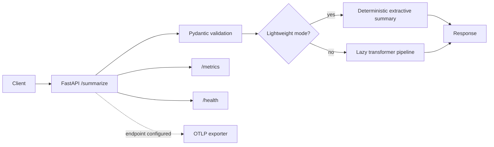

# TransformerForge

[](https://github.com/CoreyLeath-code/TransformerForge/actions/workflows/ci.yml)
[](https://github.com/CoreyLeath-code/TransformerForge/actions/workflows/security.yml)
[](https://github.com/CoreyLeath-code/TransformerForge/actions/workflows/codeql.yml)
[](LICENSE)

TransformerForge is an experimental Python service for transformer-backed text summarization. It has a deterministic extractive fallback for local development and CI, plus an optional full transformer/RAG dependency set for environments that provide the model resources.

> Status: portfolio and engineering-demo project. The lightweight mode is the supported reproducible path in this repository; it is not a claim of deployed service capacity or model-quality validation.

## What is implemented

- A FastAPI `POST /summarize` contract with bounded text and output-length inputs.
- Strict request schemas: blank, oversized, inconsistent, and undeclared fields are rejected.
- Deterministic extractive fallback mode that runs without downloading a model.
- Lazy transformer loading when lightweight mode is disabled.
- Health and Prometheus metrics endpoints.
- Opt-in OpenTelemetry export: no telemetry is exported unless `OTEL_EXPORTER_OTLP_ENDPOINT` is configured.
- A lightweight benchmark runner that records its execution environment and writes machine-readable JSON.

## Architecture



The API implementation lives in [`src/python/inference.py`](src/python/inference.py). The historical RAG prototype is retained separately under [`src/src/llm`](src/src/llm); it is not exercised by the lightweight API contract suite.

## Quick start: deterministic mode

Python 3.10 or 3.11 is the CI-supported runtime matrix.

```bash
python -m venv .venv
# macOS/Linux
. .venv/bin/activate
# Windows PowerShell: .\.venv\Scripts\Activate.ps1

python -m pip install --upgrade pip
python -m pip install -r requirements-dev.txt
```

Run the verified lightweight test path:

```bash
# macOS/Linux
TRANSFORMERFORGE_LIGHTWEIGHT_MODE=true pytest -q tests/test_api.py

# Windows PowerShell
$env:TRANSFORMERFORGE_LIGHTWEIGHT_MODE = "true"; pytest -q tests/test_api.py
```

Start the API in the same mode:

```bash
# macOS/Linux
TRANSFORMERFORGE_LIGHTWEIGHT_MODE=true uvicorn src.python.inference:app --reload

# Windows PowerShell
$env:TRANSFORMERFORGE_LIGHTWEIGHT_MODE = "true"; uvicorn src.python.inference:app --reload
```

Try it:

```bash
curl -X POST http://127.0.0.1:8000/summarize \
  -H "content-type: application/json" \
  -d '{"text":"TransformerForge validates bounded requests. It supports deterministic local execution."}'
```

## API contract

| Endpoint | Purpose |
|---|---|
| `GET /` | Service identity and version |
| `GET /health` | Lightweight liveness response |
| `GET /metrics` | Prometheus exposition format |
| `POST /summarize` | Summarize validated text |

`POST /summarize` accepts `text`, optional `min_length` (1–256), and optional `max_length` (8–512). `text` is limited to 20,000 characters. Unknown JSON fields are rejected, which keeps the public contract explicit and prevents unsupported per-request controls from being silently ignored.

## Configuration and operating modes

| Variable | Default | Effect |
|---|---|---|
| `TRANSFORMERFORGE_LIGHTWEIGHT_MODE` | `false` | Enables the deterministic no-download fallback when `true`, `1`, or `yes`. |
| `BASE_MODEL` | `facebook/bart-large-cnn` | Model identifier used only by the full transformer path. |
| `OTEL_EXPORTER_OTLP_ENDPOINT` | unset | Enables OTLP tracing to the supplied endpoint. Leave unset for no exporter. |
| `VECTORSTORE_BACKEND` | `faiss` | Used by the separate RAG prototype; `pinecone` requires its documented credentials. |

For the optional transformer/RAG stack, install `requirements-llm.txt`. That path can download models and may require substantial CPU, memory, or accelerator resources; it is not included in the deterministic CI contract.

## Verification evidence

The repository's CI workflow runs syntax validation, targeted Ruff correctness checks, API contract tests on Python 3.10 and 3.11, a container health smoke test, and a deterministic benchmark on Python 3.11. Test, coverage, JUnit, and benchmark files are uploaded as workflow artifacts.

Run the benchmark locally after installing development dependencies:

```bash
# macOS/Linux
TRANSFORMERFORGE_LIGHTWEIGHT_MODE=true python benchmarks/benchmark_lightweight.py

# Windows PowerShell
$env:TRANSFORMERFORGE_LIGHTWEIGHT_MODE = "true"; python benchmarks/benchmark_lightweight.py
```

It writes `benchmark-results/benchmark-results.json` and `benchmark-results/benchmark-results.md`. These benchmark the deterministic local path only; they do not measure transformer inference, concurrent traffic, or model quality. Treat results as environment-specific regression evidence, not service-level objectives.

## Security and reliability boundaries

- The API validates request sizes and rejects unknown fields before inference.
- Heavy model loading is lazy, so lightweight startup and tests do not require model downloads.
- Telemetry is disabled by default; configure an explicit collector endpoint before export.
- Dependency, secret, static-analysis, and SBOM workflows live in [`.github/workflows`](.github/workflows).
- Report vulnerabilities through [SECURITY.md](SECURITY.md); contribution expectations are in [CONTRIBUTING.md](CONTRIBUTING.md).

The project does not provide authentication, authorization, persistent storage, model-evaluation datasets, or production deployment guarantees. Those capabilities require a defined use case, threat model, operational owner, and evaluated model artifacts.

## Repository map

```text
src/python/inference.py        FastAPI service and lightweight/full inference modes
tests/test_api.py              API contract and failure-path tests
benchmarks/benchmark_lightweight.py
                               Deterministic benchmark runner
requirements.txt               Lightweight runtime dependencies
requirements-llm.txt           Optional transformer/RAG dependencies
Dockerfile                     Container build and health-check contract
.github/workflows/             CI, security, release, and dependency automation
```

## Development workflow

```bash
make test      # Builds the optional C++ attention library, then runs the suite
make lint      # Runs Ruff and mypy for the Python sources
docker build -t transformerforge .
```

The root Makefile includes additional Java, UI, Helm, and Terraform targets. Review the relevant files before running infrastructure or deployment commands; this repository does not apply cloud infrastructure automatically.

## Limitations and next work

- Establish a versioned evaluation corpus and task-appropriate quality metrics before making any model-quality claim.
- Add load tests with explicit concurrency, hardware, and transport assumptions before publishing API throughput targets.
- Validate full-model behavior and RAG retrieval quality separately from the deterministic fallback.
- Pin and verify third-party GitHub Actions before treating security automation as a release gate.

## License

MIT. See [LICENSE](LICENSE).


## Summary provenance and confidence boundary

The summary response includes execution-mode and model-identifier metadata. Its confidence status is deliberately `not-calibrated`: it describes validated execution provenance, not factuality or a model-quality score.
