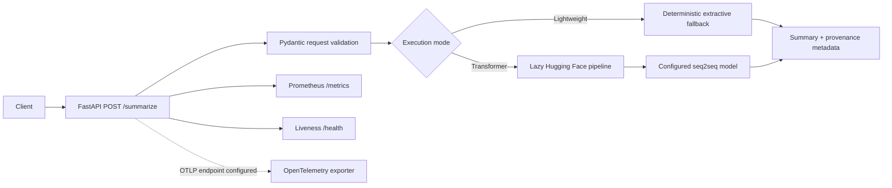
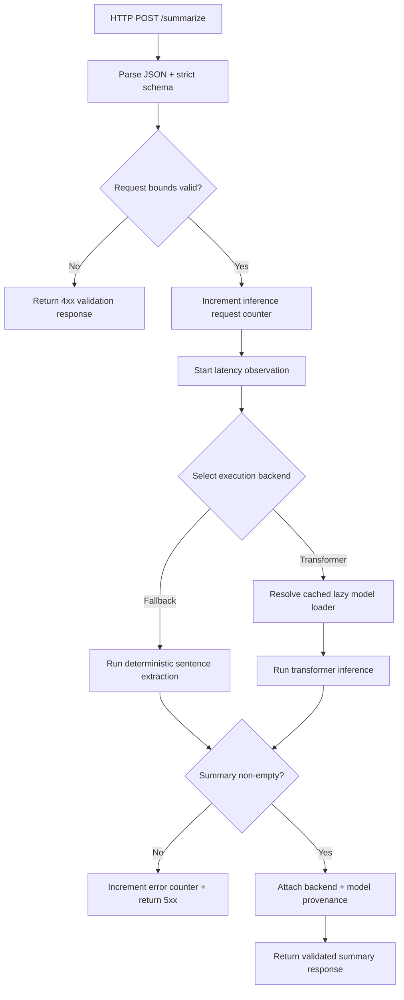

# TransformerForge

[](https://github.com/CoreyLeath-code/TransformerForge/actions/workflows/ci.yml)
[](https://github.com/CoreyLeath-code/TransformerForge/actions/workflows/security.yml)
[](https://github.com/CoreyLeath-code/TransformerForge/actions/workflows/codeql.yml)
[](https://github.com/CoreyLeath-code/TransformerForge/actions/workflows/container-scan.yml)
[](https://github.com/CoreyLeath-code/TransformerForge/actions/workflows/release.yml)
[](LICENSE)

TransformerForge is an experimental FastAPI summarization service with two deliberately separated execution paths: a deterministic extractive fallback used for reproducible CI and constrained environments, and an optional Hugging Face seq2seq transformer backend loaded lazily when model dependencies and resources are available.

> **Evidence boundary:** the repository verifies the deterministic path, API contract, container health, security automation, and reproducible microbenchmark protocol. It does **not** claim validated transformer quality, RAG quality, production throughput, or calibrated factuality.

## Engineering scope

Implemented:

- Strict `POST /summarize` schema with bounded text and output-length controls.
- Deterministic no-download summarization mode for CI and local reproducibility.
- Lazy Hugging Face transformer loading with configurable `BASE_MODEL`.
- Explicit execution provenance in responses (`backend`, `model_id`, confidence status).
- Prometheus metrics and opt-in OpenTelemetry export.
- Non-root multi-stage container image with a live health check.
- Python 3.10/3.11 CI, API contract tests, container smoke test, security scanning, SBOM automation, and reproducible lightweight benchmarks.
- Semantic-tag GitHub Release automation with source archive, SHA-256 checksum, and GHCR image publishing.

Not claimed:

- Production SLOs or availability.
- Authentication/authorization or multi-tenant isolation.
- Validated RAG retrieval quality.
- ROUGE/BERTScore/factuality/hallucination improvements.
- Full-model load, concurrency, GPU, or network benchmarks.

## Architecture



The verified service path is implemented in `src/python/inference.py`. A separate historical RAG prototype remains under `src/src/llm`; it is not represented as part of the verified API path.

## System design flow



## Quickstart

Python 3.10 and 3.11 are exercised in CI.

```bash
python -m venv .venv
. .venv/bin/activate
python -m pip install --upgrade pip
python -m pip install -r requirements-dev.txt
```

Run the verified deterministic contract:

```bash
TRANSFORMERFORGE_LIGHTWEIGHT_MODE=true pytest -q tests/test_api.py
```

Start the API:

```bash
TRANSFORMERFORGE_LIGHTWEIGHT_MODE=true \
uvicorn src.python.inference:app --host 0.0.0.0 --port 8000
```

Call it:

```bash
curl -X POST http://127.0.0.1:8000/summarize \
  -H 'content-type: application/json' \
  -d '{"text":"TransformerForge validates bounded requests. It supports deterministic local execution.","min_length":8,"max_length":128}'
```

## Container quickstart

```bash
docker build -t transformerforge:local .
docker run --rm -p 8000:8000 \
  -e TRANSFORMERFORGE_LIGHTWEIGHT_MODE=true \
  transformerforge:local
curl --fail http://127.0.0.1:8000/health
```

The image runs as a non-root user and exposes port 8000.

## API contract

| Endpoint | Purpose |
|---|---|
| `GET /` | Service identity and version |
| `GET /health` | Lightweight liveness response |
| `GET /metrics` | Prometheus exposition format |
| `POST /summarize` | Validated summarization request |

`POST /summarize` accepts `text`, optional `min_length` (1–256), and optional `max_length` (8–512). Input text is limited to 20,000 characters, unknown fields are rejected, and `min_length` cannot exceed `max_length`.

## Reproducibility

The deterministic benchmark runner is committed at `benchmarks/benchmark_lightweight.py` and forces lightweight mode with telemetry disabled.

```bash
TRANSFORMERFORGE_LIGHTWEIGHT_MODE=true \
python benchmarks/benchmark_lightweight.py
```

It writes:

```text
benchmark-results/benchmark-results.json
benchmark-results/benchmark-results.md
```

Protocol:

| Workload | Warm-up | Timed iterations |
|---|---:|---:|
| `fallback_summary` | 1,000 | 20,000 |
| `request_validation` | 1,000 | 20,000 |
| `api_summarize_request` | 1,000 | 3,000 |

Each workload reports mean, median, p95, p99, standard deviation, and derived single-thread operations/second. CI executes this on Python 3.11 and uploads benchmark artifacts together with coverage/JUnit evidence.

### Research-style interpretation

These are deterministic **microbenchmarks**, not production service benchmarks. `api_summarize_request` uses FastAPI `TestClient`, so it does not include real network, TLS, proxy, process-to-process, or concurrent-load costs. Results are environment-specific and should always be accompanied by commit SHA, Python/runtime, runner/hardware, warm-up count, sample count, and execution mode.

No transformer-quality or RAG-quality number is published because the repository does not yet commit a versioned evaluation corpus and acceptance protocol. See [Metrics.MD](Metrics.MD).

## Configuration

| Variable | Default | Effect |
|---|---|---|
| `TRANSFORMERFORGE_LIGHTWEIGHT_MODE` | `false` | Uses deterministic extractive mode when `true`, `1`, or `yes`. |
| `BASE_MODEL` | `facebook/bart-large-cnn` | Hugging Face model used by the transformer path. |
| `OTEL_EXPORTER_OTLP_ENDPOINT` | unset | Enables OTLP tracing when explicitly configured. |
| `VECTORSTORE_BACKEND` | `faiss` | Applies to the separate historical RAG prototype. |

Install `requirements-llm.txt` only when exercising the optional transformer/RAG stack. That path can download substantial model artifacts and is outside the deterministic CI contract.

## Verification and release contract

CI validates Python syntax, targeted Ruff correctness checks, API tests with coverage on Python 3.10/3.11, a container build plus live `/health` smoke test, and the benchmark protocol. Security workflows include CodeQL, dependency review, container scanning, and additional supply-chain checks.

A semantic version tag matching `v*.*.*` triggers the release workflow. The workflow can also be manually dispatched for an existing tag. A successful release publishes:

```text
vX.Y.Z
├── GitHub Release
│   ├── transformerforge-vX.Y.Z.tar.gz
│   └── transformerforge-vX.Y.Z.sha256
└── GHCR
    ├── ghcr.io/coreyleath-code/transformerforge:vX.Y.Z
    └── ghcr.io/coreyleath-code/transformerforge:latest
```

## L6 engineering assessment

The strongest aspects are explicit API bounds, deterministic CI behavior, lazy heavyweight initialization, observability hooks, container smoke testing, and a clear separation between measured and unmeasured claims.

The highest-value next steps are:

1. Commit a versioned summarization evaluation corpus with task-specific quality metrics and error taxonomy.
2. Add full-model tests pinned to an exact model revision rather than a mutable model identifier alone.
3. Add controlled concurrency/load experiments with real HTTP transport and documented CPU/GPU hardware.
4. Add readiness semantics that distinguish process liveness from transformer-backend readiness.
5. Add authentication, request budgets, rate limits, and explicit abuse/threat-model controls before any exposed deployment.
6. Add model/artifact integrity verification and release provenance/signing for model-bearing deployments.
7. Validate RAG independently with retrieval relevance metrics before presenting it as part of the supported system.

See [L6_AUDIT.md](L6_AUDIT.md) for the detailed review.

## Interview / reviewer Q&A

**Why is the deterministic fallback important?**  
It gives CI a stable, no-download path for validating schemas, failure behavior, observability plumbing, packaging, and regression characteristics without conflating those checks with transformer quality.

**Does the benchmark prove the API can handle production traffic?**  
No. It is an in-process deterministic microbenchmark. Capacity requires real transport, controlled concurrency, hardware disclosure, repeated trials, and saturation/error analysis.

**Is RAG part of the verified serving architecture?**  
No. A historical RAG prototype exists separately, but the verified `/summarize` path does not route through it.

**Does `confidence_status=not-calibrated` mean the summary is unreliable?**  
It means the service deliberately avoids presenting an unsupported factuality/confidence score. Calibration requires an evaluation dataset and a defensible mapping between scores and real-world correctness.

**Why publish both a GitHub Release and GHCR package?**  
The source archive/checksum provides an inspectable versioned source artifact, while GHCR provides the containerized execution artifact associated with that release line.

## Repository map

```text
src/python/inference.py          Verified FastAPI service
src/python/attention.py          Attention-related experimentation
src/python/train.py              Training experimentation
src/src/llm/                     Historical optional LLM/RAG prototype
tests/test_api.py                API contract/failure-path tests
benchmarks/benchmark_lightweight.py
                                Deterministic benchmark protocol
requirements.txt                 Container/runtime dependencies
requirements-dev.txt             CI/development dependencies
requirements-llm.txt             Optional transformer/RAG stack
Dockerfile                       Non-root multi-stage service image
.github/workflows/               CI, security, release automation
```

## License

MIT. See [LICENSE](LICENSE).
