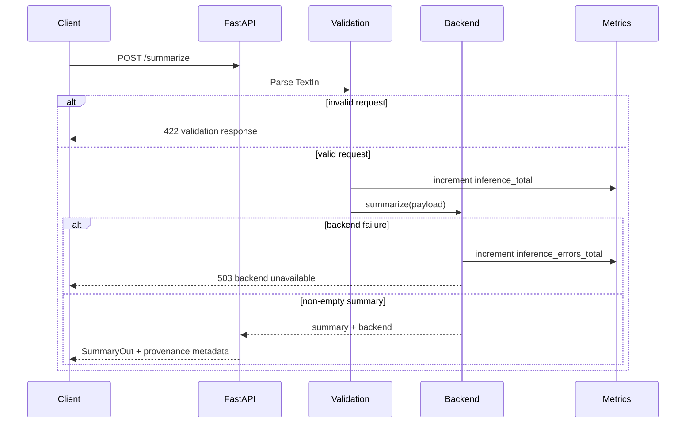

# TransformerForge Architecture

## Verified service architecture

```mermaid
flowchart LR
    Client --> API[FastAPI /summarize]
    API --> Validation[Pydantic request validation]
    Validation --> Mode{Execution mode}
    Mode -->|lightweight| Extractive[Deterministic extractive fallback]
    Mode -->|transformer| Loader[Lazy cached Hugging Face loader]
    Loader --> Model[Configured seq2seq model]
    Extractive --> Response[Summary + execution provenance]
    Model --> Response
    API --> Health[/health]
    API --> Metrics[/metrics]
    API -. optional .-> OTLP[OpenTelemetry exporter]
```

## Request lifecycle



## Deployment boundary

The Docker image packages the verified FastAPI service and lightweight runtime dependencies. `requirements-llm.txt` represents the optional transformer/RAG dependency surface and is not installed in the default deterministic CI image unless explicitly incorporated into another environment.

The repository also contains broader infrastructure and historical RAG experiments. They are not shown in the verified serving architecture unless they are exercised by the service contract and CI.

## Reliability model

- `/health` is a liveness endpoint, not proof that a transformer model has been downloaded and initialized.
- Lightweight mode is the reproducible CI contract.
- Full transformer mode depends on model availability, memory/accelerator capacity, and external model artifact access.
- OpenTelemetry export is disabled unless an exporter endpoint is configured.
- Prometheus metrics are process-local service instrumentation; they are not service-level objectives.
